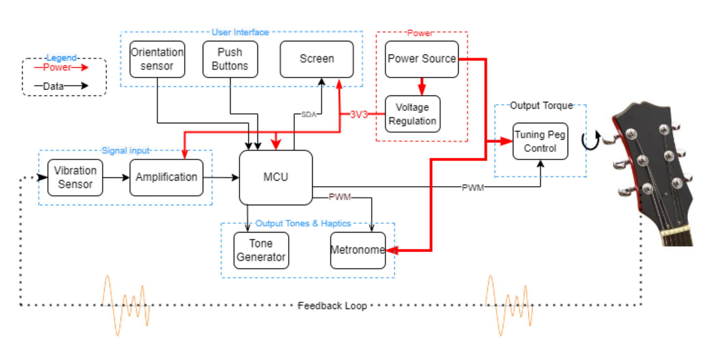
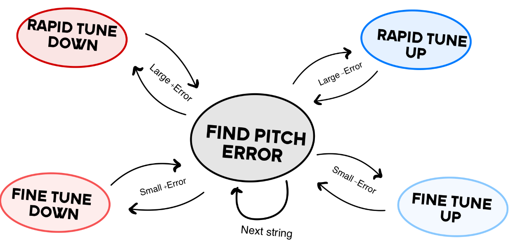

<p align="center">
  <strong><font size="+3">AUTO-TUNER</font></strong>
</p>
<p align="center">
  <font size="+1">An STM32-Based Automatic Guitar Tuner</font>
</p>


## About
The Auto-Tuner (AT) is a handheld device designed to automatically tune guitar strings one at a time. It operates by placing the tuning motor fork over one of the guitar’s tuning pegs and then plucking the corresponding string. The AT detects the string’s pitch through vibration sensing and adjusts the tuning peg until the string reaches the correct pitch.  Once the string is in tune, the device alerts the user by emitting two short vibration pulses. Click the thumbnail below to see it in action!

<p align="center">
  <a href="https://www.youtube.com/watch?v=4Ss6xfbAHeE">
    
  </a>
</p>


## Auto-Tuner Design
A high-level block diagram of the Auto-Tuner’s design is shown below. Key features include an OLED screen and navigation buttons for menu control, along with a tone generator, metronome, and a gyroscope that ensures the screen remains correctly oriented in all positions during operation. However, the core tuning functionality of the AT lies in its vibration sensing and motor control, which operate within a feedback loop.



First, a piezo transducer detects string vibrations through the contact the Auto-Tuner makes with the guitar’s tuning peg. The signal is then amplified, offset, and low-pass filtered before being sampled by the microcontroller’s ADC. A pitch detection algorithm determines the pitch of the plucked string, and a state machine calculates the necessary motor rotation and direction based on the error between the detected and desired pitch. The motor then adjusts the tuning peg, after which the pitch is resampled, and the process repeats until the error falls below a defined threshold.


### Pitch Detection
The naïve approach to pitch detection for a musical instrument is to take the Fourier transform of the string vibration and identify the bin with the highest peak. Unfortunately, stringed instruments have a peculiar characteristic where the fundamental frequency of a pitch may not have the largest peak—or may not even be present at all. One way to overcome this issue is to use an autocorrelation-based algorithm, which can determine the fundamental frequency of a signal even when it is missing. 

For this project, [McLeod’s Pitch Method](https://www.cs.otago.ac.nz/graphics/Geoff/tartini/papers/A_Smarter_Way_to_Find_Pitch.pdf) (MPM) was implemented for pitch detection. MPM operates in three main phases: frequency detection, peak picking, and parabolic interpolation.

The frequency detection phase relies on the square difference function shown below. Expanding this function reveals that it consists of an autocorrelation component and a sum of squares:

```math
d(\tau) = \sum_{j=t}^{t+W-\tau} (x_j - x_{j+\tau})^2 = \sum_{j=t}^{t+W-\tau} x_j^2 + x_{j+\tau}^2 - 2x_j x_{j+\tau}
```

Dividing by the sum of squares results in the normalized square difference function (NSDF):
```math
n(\tau) = \frac{\sum_{j=t}^{t+W-\tau} 2x_j x_{j+\tau}}{\sum_{j=t}^{t+W-\tau} x_j^2 + x_{j+\tau}^2}
```

The NSDF output is similar to an autocorrelation function, except its values are constrained within the range [-1,1]. The largest peak in the NSDF corresponds to a lag τ where the detected frequency is given by the sample rate divided by τ. The benefit of normalization is that it allows for an easily defined threshold to detect this peak. Based on experimentation, selecting the first major peak that exceeds a threshold of 0.9 produced the most reliable results.

However, pitch detection accuracy is limited by the discrete nature of lag values. To refine the estimate, parabolic interpolation is applied to approximate the peak’s true position between lag values. Once the peak's lag is identified, its value and those of its nearest neighbors are used to fit a parabola. The peak of this parabola provides a more precise estimate of the actual pitch.

### State Machine
Initially, a PID controller was considered for tuning motor control. However, this approach required the motor and piezo transducer to operate simultaneously. The problem was that motor vibrations heavily impacted the frequency spectrum, making pitch detection unreliable.

To address this, a state machine was implemented to alternate between pitch detection and motor control. As shown below, the state machine calculates the error between the current and target pitch, then adjusts the motor’s direction and speed based on the magnitude and polarity of the error. After each motor activation, the pitch error is recalculated, and the process repeats. Larger pitch errors result in greater motor adjustments.

Once the pitch error stays within ±5 cents of the target for five consecutive samples, the system moves to the next string and repeats the process.


<div align="center">
  
</div>

## Results
The accuracy of the Auto-Tuner was evaluated using a high-precision guitar tuner. The target was to achieve a tuning error within 6 cents, as this is near the threshold of human pitch perception.

Testing showed that most strings had a tuning error of 2-3 cents, while the G3 string exhibited a slightly higher error of around 6 cents. Despite this, the Auto-Tuner successfully met the desired accuracy specifications.